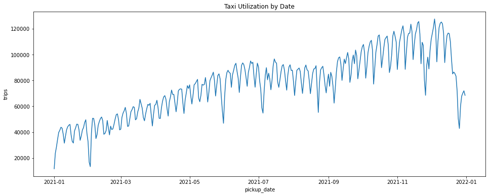
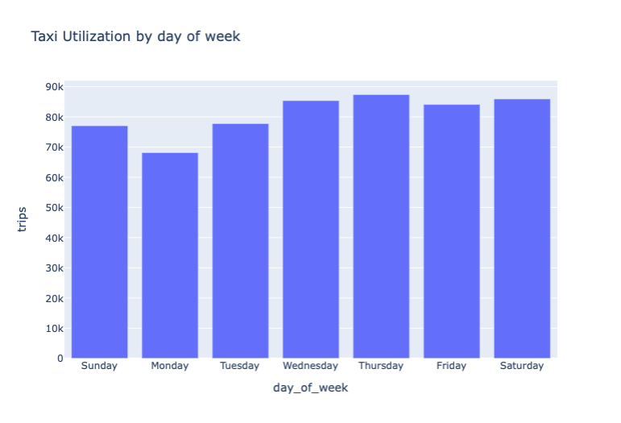
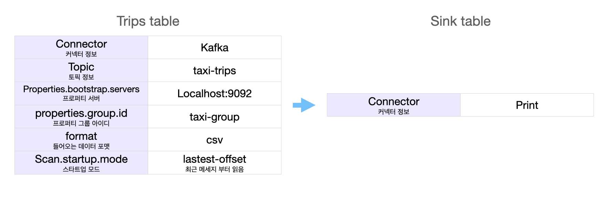

# 🚕 NewYork Taxi Pricing Predict
201637011 강동우

# 1. Definition

> 과거 기반의 데이터와 실시간 데이터를 기반으로 수요와 공급의 예측을 통해 가격을 조정하려고 한다.

- 대용량 데이터의 아키텍쳐 설계와 파이프라인 구축을 위해 택시 요금을 예측한다.

## 파일 트리
```
├── README.md
├── batch
│   ├── notebook
│   │   ├── taxi-analysis.ipynb
│   │   ├── taxi-fare-prediction-hyper-parameter.ipynb
│   │   ├── taxi-fare-prediction-preprocessing.ipynb
│   │   └── taxi-fare-prediction.ipynb
│   └── py
│       ├── preprocessing.py
│       ├── train_predict.py
│       └── tune_hyperparamenter.py
├── data
│   ├── model
│   │   ├── data
│   ├── taxi+_zone_lookup.csv
│   ├── test
│   ├── train
│   └── trips
├── stream
└── templates
    ├── readme_pipeline.png
    ├── 날짜별_택시_이용_시각화.png
    ├── 요일별_택시_이용_시각화.png
    └── 택시 이용에 따른 지불 방법_시각화.png
```
## 기술 스택
- Python 3.8
- Spark SQL, ML
- Airflow
- Flink
- Kafka

## 파이프 라인


1. **배치 프로세싱(기존 데이터 기반)**
    - 오프라인 배치 프로세싱에는 머신러닝 학습을 진행한다.
2. **스트리밍 프로세싱(실시간)**
    - 택시 요금, 이동 시간은 실시간으로 예측을 진행한다.


## 실행 계획
|No.|Title|Decription|Stack|URL|
|---|---|---|---|---|
|1|New York Taxi Data Analysis (뉴욕 택시 데이터 분석)|뉴욕 택시 데이터 분석을 진행|`spark SQL`, `jupyter Notebook`||
|2|Taxi Pricing Prediction (택시비  예측)|택시비 예측 후 파라미터 최적화 및 모델 저장|`spark ML`, `jupyter Notebook`||
|3|Taxi Pricing PipeLine (택시비 예측 파이프라인 관리) |Airflow를 통해 택시비에 대한 파이프라인을 구축및 관리|`Airflow`, `Spark`||
|4|Taxi Pricing Event Processing (택시비 이벤트 처리) |카프카를 이용하여 택시 Producer, Topic을 만들고 메세지 확인할 수 있게 구현|`Kafka`, `Spark`||
|5|Taxi Pricing (택시정보 받아 택시비 예측) |Flink를 이용하여 택시 정보를 받아 택시비 예측|`Flink`, `Spark`||

# 2. Batch Process
1. TLC 사이트에서 데이터를 수집 후 Spark SQL 쿼리를 통해 데이터 프레임 생성 
2. Outlier 제거를 위한 데이터 클리닝
3. 시각화 작업 
    - `pickup_date`를 활용한 택시 이용률
    - `DATE_FORMAT` 이나 사용자 정의 함수를 이용해 요일별 택시 이용률
    - 사용자 정의 함수를 이용해 지불 타입 도출

## 분석 및 시각화



- 우선, 택시 이용자 수가 증가하는 것을 알 수 있으며, 요일 마다 격차가 크다는 것을 알 수 있었다.
- 요일 별로 보게되면, 다른 요일에 비해 월요일 택시 이용자 수가 적다는 것을 알 수 있다.


- 지불 방식에 대해서는 Credit Card로 지불하는 사람들이 가장 많으며, 금액에 대한 분쟁도 꽤 일어난다는 것을 알 수 있다.

## 머신러닝 예측
|No|r2 score|RMSE|Description|Link|
|---|---|---|---|---|
|1|0.70|7.91|초기 예측 모델|[💾]()|
|2|0.81|6.2|OneHot Encoding, Standard Scaling, Vector Assembler등 전처리|[💾]()|
|3|0.81|6.2|Parameter Tuning (elesticNet, Regression)|[💾]()|

- 10마일 정도 가는데 41불 정도로 예측되었고 거리가 길수록 예측 확률도 높아진다는 것을 알 수 있었다. (초기 예측)
- 전처리 이후, 좋은 성능이 나온 것으로 확인되었다.

## Batch Data Pipeline 구축
택시비 예측을 위해 `Airflow`를 이용하여 파이프라인을 구축한다. 
```
preprocess >> tune_hyperparameter >> train_predict
```


## 성능 개선
- 데이터 클리닝 도중, `total_amount` 와 `trip_distance`등 에서 이상값(Outlier)를 발견
    > 해결 : `WHERE` 을 통해 새 쿼리를 만들어 데이터 전처리
- 초기 예측 성능이 70%(R2)정도 나왔다. 좋은 성능은 아니지만 적당한 결과였다. 
- `OneHoTEncoding`과 `StandardScaler`, `VectorAssembler`를 통해 numerical Data와 Categorical data를 전처리 한 컬럼을 이용해 예측 성능을 내보았다.
    > 해결 : 지난 초기 예측 성능 보다 10% 향상된 좋은 성능이 나왔다. (80%)
    > 해결2 : 파라미터 튜닝을 진행하였지만 차이가 없는 같은 성능이 나왔다.
- Airflow와 Local Python의 환경이 맞지 않아 생기는 문제 발생
    ```
    airflow.exceptions.AirflowException: Cannot execute: spark-submit --master yarn --name arrow-spark /Users/dongwoo/new_york/batch/py/preprocess.py. Error code is: 1.
    ```
    > 해결 : 위 코드를 입력하여 재 실행!

---
# 3. Stream Process


## 택시 Trips 데이터를 보낼 Producer 만들기
- 택시 Trips 데이터를 통해 Price 예측하는 과정이다.

- compose 파일을 만듭니다.
    - zookeeper
    - kafka
    - kafdrop

- `docker-compose up`으로 kafka 클러스터를 만든다.

- [LocalHost](http://localhost:9000)링크를 통해 KafDrop이 열리는 것을 확인하였다.
    - `taxi-trips` 라는 토픽을 생성합니다.

- producer 파일을 이용해서 데이터를 보내준다.

## Flink를 통해 택시 정보를 받아오기
- 데이터를 받을 Kafka Consumer는 내장되어 있지 않기 때문에  오류 발생을 막기 위해 `kafka connector`를 다운 받는다.

```py
kafka_jar_path = os.path.join(
  os.path.abspath(os.path.dirname(__file__)), "../",
  "flink-sql-connector-kafka_2.11-1.14.0.jar"
)
t_env.get_config().get_configuration().set_string(
  "pipeline.jars", f"file://{kafka_jar_path}"
)
```


- 

## 성능 개선 
- `Error Starting userland proxy: listem tcp 0.0.0.0:XXXX: bind: address already in ~` 으로 포트가 겹쳐서 에러가 발생했다.
    > 해결 :  `netstat` 으로 포트를 확인한 후 이미 사용중인 상태라면 `docker-compose down docker rm -fv` 로 컨테이너를 제거했다.
    > - `kill -9 PID`로 포트를 제거할 수 있다. 

- `UnicodeDecodeError: 'utf-8' codec can't decode byte 0x8b in position 19: invalid start byte`
    - `parquet` 파일을 인코딩했을 때, read한 로우 값이 제대로 인코딩 되지 않았다.
    - `cp949`를 사용했지만 변화가 없자 parquet to csv를 했다.
    - [참고링크](https://blog.naver.com/PostView.nhn?blogId=koys007&logNo=221850810999)
