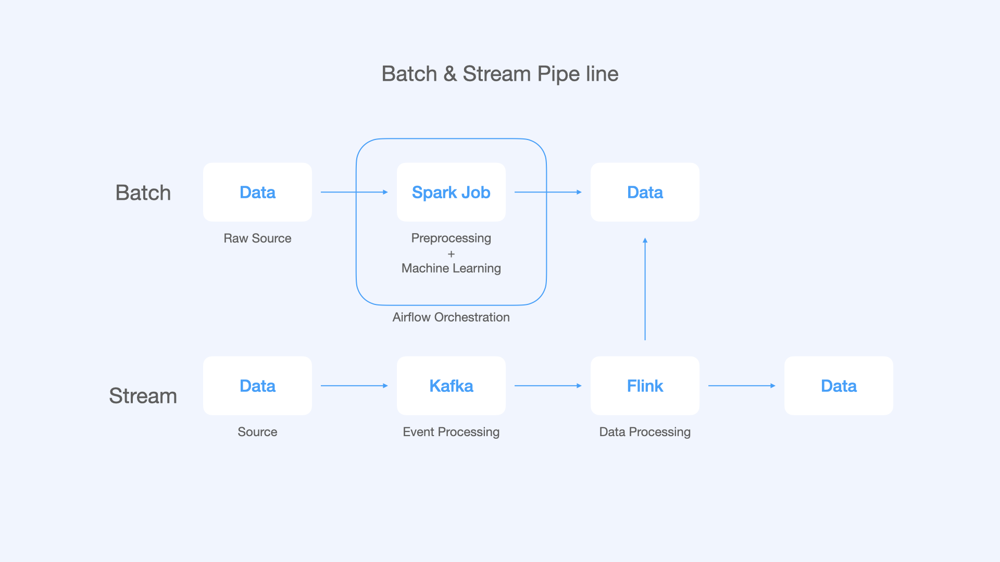

# 🚕 NewYork Taxi Pricing Predict
201637011 강동우

## 의사 결정 배경
과거 기반의 데이터와 실시간 데이터를 기반으로 수요와 공급의 예측을 통해 가격을 조정하려고 한다.

## 파일 트리
```

```
## 기술 스택
- Python 3.8
- Spark SQL, ML
- Airflow
- Flink
- Kafka

## 파이프 라인

- Batch Processing :  머신러닝 학습
- Stream Processing : 걸리는 시간 예측



## 과정
|No.|Title|Decription|Stack|URL|
|---|---|---|---|---|
|1|New York Taxi Data Analysis (뉴욕 택시 데이터 분석)|뉴욕 택시 데이터 분석을 진행한다.|`spark SQL`, `jupyter Notebook`||
|2|Taxi Pricing Prediction (택시비  예측)|택시비 예측 후 파라미터 최적화 및 모델 저장|`spark ML`, `jupyter Notebook`||
|3|Taxi Pricing PipeLine (택시비 예측 파이프라인 관리) |Airflow를 통해 택시비에 대한 파이프라인을 구축및 관리|`Airflow`, `Spark`||
|4|Taxi Pricing Event Processing (택시비 이벤트 처리) |카프카를 이용하여 택시 Producer, Topic을 만들고 메세지 확인할 수 있게 구현하기|`Kafka`, `Spark`||
|5|Taxi Pricing (택시정보 받아 택시비 예측) |Flink를 이용하여 택시 정보를 받아 택시비 예측하기|`Flink`, `Spark`||


## 성능 개선